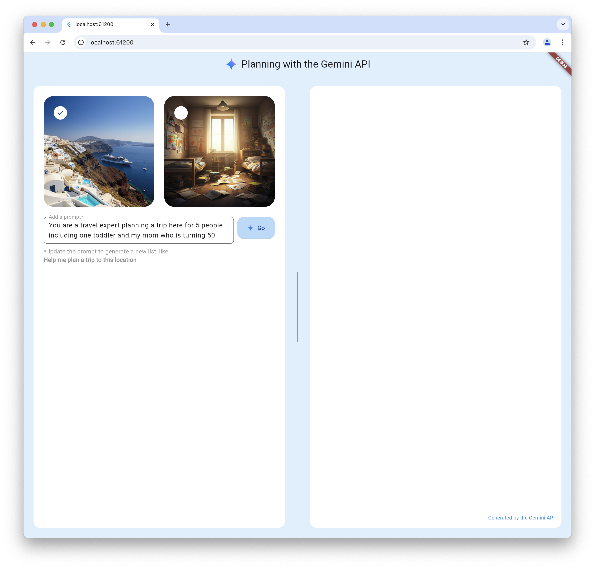
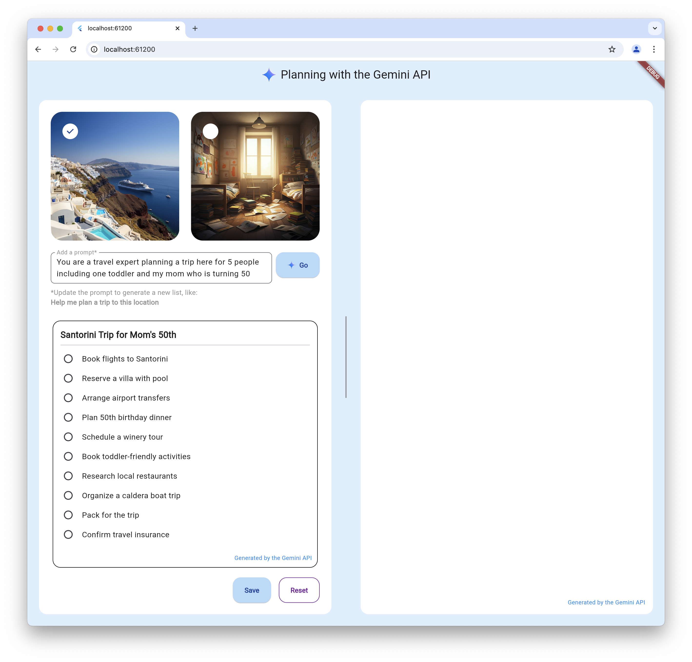
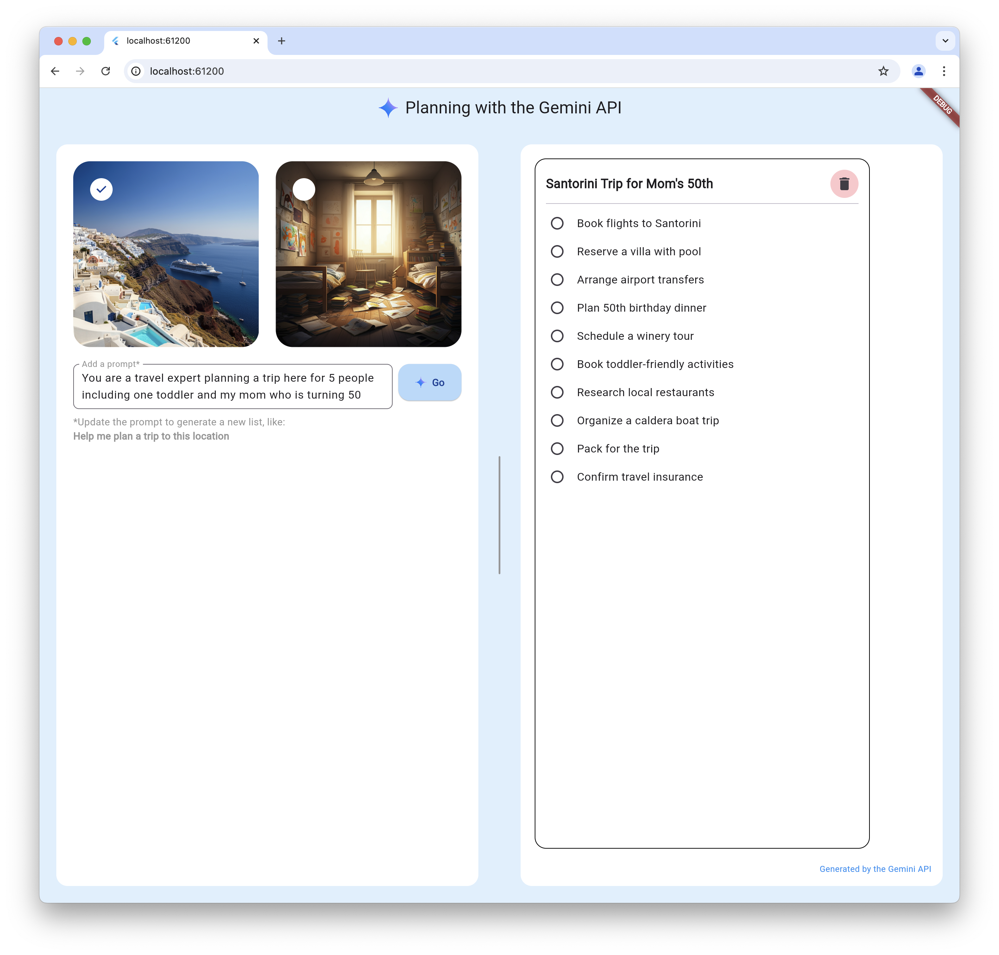

# Make It So, Flutter!

The make-it-so-flutter repository contains a sample app showcasing the power of
Google generative AI. It's written using Flutter, [the Flutter AI
Toolkit](https://docs.flutter.dev/ai-toolkit), [the Google AI Dart SDK
package](https://pub.dev/packages/google_generative_ai) and [the Vertex AI in
Firebase Flutter package](https://pub.dev/packages/firebase_vertexai).

Inspired by the [Make It So,
Angular](https://github.com/FirebaseExtended/make-it-so-angular) sample, the
Make It So, Flutter sample app uses a Gemini LLM to combine the image you select
with the prompt you enter to create a plan that you can save onto a dashboard.
The responsive UI makes it work well on all Firebase-support platforms: macos,
web, Android and iOS.

Enjoy!

# Getting Started

## Vertex AI
To use this sample with Vertex AI requires a Firebase project, which you then
initialize in your app. You can learn how to set that up with the steps
described in [the Get started with the Gemini API using the Vertex AI in
Firebase SDKs
docs](https://firebase.google.com/docs/vertex-ai/get-started?platform=flutter).

## Gemini AI
To use Google Gemini AI, [obtain an API key from Gemini AI
Studio](https://aistudio.google.com/app/apikey). Be careful not to check this
key into your source code repository to prevent unauthorized access. You'll see
a TODO statement the `lib/views/planner_view.dart` file where you paste your API
key.

# Usage

To use planner, you're first asked to select an image and enter a prompt (a
sample prompt for each image is provided for you):



Pressing the Go button yields a plan generated by the LLM:



Pressing the Save button moves the plan to the dashboard where you can interact
with the items in your plan:



Once you're done with a plan, you can remove it from the dashboard with the
trashcan icon in the upper right of each plan.

# Implementation details

The planner sample interacts with the Google LLM in the `_goPressed` function:

```dart
class _PlannerViewState extends State<PlannerView> {
  static const _systemInstruction = '''
Keep task names short; names ideally within 7 words.

Use the following schema in your response:
{
  "title":"string",
  "subtasks":"string[]"
}

The substasks should follow logical order''';

  // NOTE: This is the Gemini AI code; the Vertex AI code is nearly identical
  final _provider = GeminiProvider(
    model: GenerativeModel(
      apiKey: 'TODO: Gemini API Key',
      model: 'gemini-2.0-flash',
      generationConfig: GenerationConfig(responseMimeType: 'application/json'),
      systemInstruction: Content.text(_systemInstruction),
    ),
  );

  ...

  Future<void> _goPressed() async {
    setState(() {
      _isGenerating = true;
      _plan = null;
    });

    final text = _controller.text;
    final prompt =
        'Generate a title and list of tasks for $text '
        'using the ${_selectedImageChoice.name}.png image provided.';

    final image = await rootBundle.load(_selectedImageChoice.assetPath);
    final imageAttachment = ImageFileAttachment(
      name: '${_selectedImageChoice.name}.png',
      mimeType: 'image/png',
      bytes: image.buffer.asUint8List(),
    );

    final result =
        await _provider
            .generateStream(prompt, attachments: [imageAttachment])
            .join();

    setState(() {
      final json = jsonDecode(result);
      _plan = Plan.fromJson(json);
      _isGenerating = false;
    });
  }
}
```

You can see from the initialization of the model that it's been instructed to
generate a list of tasks from the user's prompt and the image that the user
chose. The plan -- a list of tasks and a title -- is generated in JSON according
to the requested schema to make it easy for the sample app to parse. Once a plan
is generated by the LLM and parsed by the app, its shown to the user and can be
saved to the dashboard or not as they chooses.

# Multi-platform

This sample has been tested and works on all supported Firebase platforms:
Android, iOS, web and macOS.

# Feedback

Are you having trouble with this app even after it's been configured correctly?
Feel free to drop issues or, even better, PRs, into [the make-it-so-flutter
repo](https://github.com/FirebaseExtended/make-it-so-flutter).